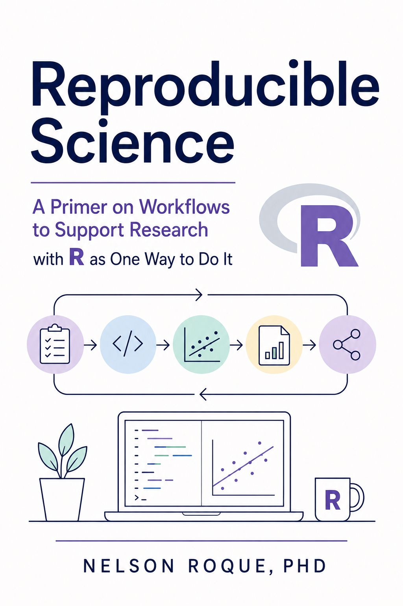

::: {.hero}
::: {.content-visible when-format="html"}
<div class="hero-copy">
<p class="eyebrow">An open CASCADE Lab course</p>

# Make your research easier to trust.

<p class="lead">Learn a practical, code-first approach to reproducible data science—from organizing a project to wrangling messy data, working with APIs, mining text, and building models.</p>

<div class="hero-actions">
  <a class="course-button primary" href="01-whatis-reproducible-science.qmd">Start the course <span aria-hidden="true">→</span></a>
  <a class="course-button" href="#course-map">Explore the syllabus</a>
</div>
</div>

:::
:::

```{=typst}
= Preface
```

::: {.course-stats aria-label="Course at a glance"}
<div class="course-stat"><strong>15</strong><span>focused chapters</span></div>
<div class="course-stat"><strong>4</strong><span>learning stages</span></div>
<div class="course-stat"><strong>Free</strong><span>open-access material</span></div>
:::

## What you will learn

By the end of the course, you will be able to:

- explain why reproducibility matters and apply the FAIR principles;
- organize research as a durable, code-based workflow;
- import, inspect, reshape, join, and visualize real-world data;
- work with dates, survey exports, text, JSON, and public APIs; and
- move from exploratory analysis toward regression and multilevel models.

## Course map {#course-map}

Choose a module or follow the course in order. Each lesson includes focused explanations and code you can adapt to your own work.

::: {.module-grid}
<a class="module-card" href="01-whatis-reproducible-science.qmd">
  <span class="module-index">Stage 01 · Foundations</span>
  <h3>Why reproducibility?</h3>
  <p>Build the mental model: reproducibility, replication, FAIR principles, and the tools that support open science.</p>
  <span class="module-link">Begin with the why →</span>
</a>

<a class="module-card" href="03-r-basics.qmd">
  <span class="module-index">Stage 02 · Working in R</span>
  <h3>Build a dependable workflow</h3>
  <p>Learn R syntax, file operations, project anatomy, and the date-handling patterns that appear in everyday research.</p>
  <span class="module-link">Learn the workflow →</span>
</a>

<a class="module-card" href="06-datawrangling-viz-survey.qmd">
  <span class="module-index">Stage 03 · Wrangling & analysis</span>
  <h3>Turn messy data into evidence</h3>
  <p>Practice with surveys, large datasets, text, JSON, APIs, visualization, regression, and multilevel models.</p>
  <span class="module-link">Work with data →</span>
</a>

<a class="module-card" href="12-resources.qmd">
  <span class="module-index">Stage 04 · Keep learning</span>
  <h3>Continue beyond the course</h3>
  <p>Use the curated resources, workshop materials, and recordings to deepen your practice.</p>
  <span class="module-link">Browse resources →</span>
</a>
:::

## A suggested learning path

<ol class="learning-path">
  <li><strong>Understand the standard.</strong><span>Start with reproducibility and the FAIR principles.</span></li>
  <li><strong>Set up the workflow.</strong><span>Learn the tools, R foundations, and project structure.</span></li>
  <li><strong>Practice on varied data.</strong><span>Move through survey, time-series, text, JSON, and API examples.</span></li>
  <li><strong>Analyze and communicate.</strong><span>Build models, create production-ready outputs, and document your decisions.</span></li>
</ol>

::: {.callout-tip title="How to use this course"}
You can read the lessons without installing anything. To run the examples, clone the repository, open the R project, and work through the chapters in order. Use the search button or press `/` whenever you need to find a topic quickly.
:::

## About the course

This open course was created by **Nelson Roque, PhD**, Director of the CASCADE Lab at The Pennsylvania State University. It is designed to give the next generation of scientists a more confident start with reproducible, code-based research.

[Visit the CASCADE Lab](https://thecascadelab.com/){.course-button}
